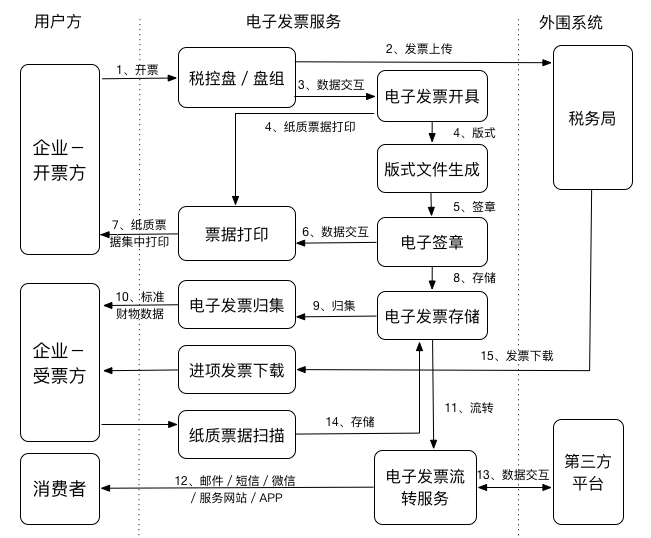
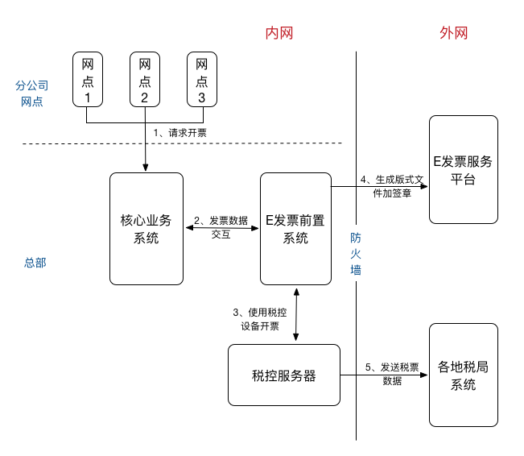
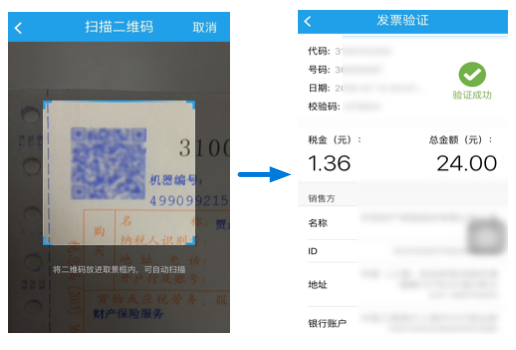
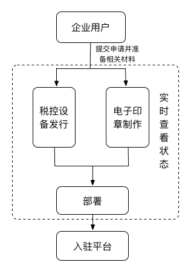

# E发票产品白皮书

本文介绍了电子发票系统的背景和现状，以及E发票电子发票服务平台的发展背景、产品架构、使用场景、解决方案及主要功能。

## 电子发票发展背景

电子发票是在购销商品、提供或接受服务以及从事其他经营活动中，开具和收取的以电子方式存储的收付款凭证。电子发票和纸质发票一样由税务局统一发放，发票号码也使用全国同一编码，并附有电子税局的签名机制。

在电子商务和通讯技术飞速发展的时代，电子发票在保管、查询、调阅时更加方便，也便于电子商务网站为消费者提供更加方便的服务。发行电子发票将大幅节省企业在发票上的成本，节约发票印制成本，从而减少纸张浪费，低碳环保。此外，电子发票系统可以与企业内部的ERP、CRM、SCS等系统相结合，发票资料全面电子化并集中处理，有助于企业本身的账务处理，并能及时为企业经营者提供决策支持。

为进一步适应经济社会发展和税收现代化建设需要，税务总局在增值税发票系统升级版基础上，组织开发了增值税电子发票系统，经过前期试点，系统运行平稳，具备了全国推行的条件，决定自2015年12月1日起在全国范围推行。根据国家税务总局2015年第84号文件，增值税电子普通发票的开票方和受票方需要纸质发票的，可以自行打印增值税电子普通发票的版式文件，其法律效力、基本用途、基本使用规定等与税务机关监制的增值税普通发票相同。

## E发票特点

E发票平台是国家税务总局指定的电子发票平台，其解决方案符合《中华人民共和国税务行业-电子发票标准体系》、《国际标准化组织：ISO/IEC19845统一商业语言-电子发票》和《中华人民共和国发票管理办法》，并且在全球190多个国家合规。通过百望电子发票服务开具的电子发票均为真实有效的合法发票，与传统纸质发票具有同等法律效力，可作为用户维权、保修和报销的有效凭证。

在开具电子发票前，开票方企业或个人需要按照税务系统流程申请合法的电子发票开具资格，也可以通过在E发票平台注册，由E发票协助完成申请流程。

终端消费者只需要在手机上下载百望股份的“E发票”APP或访问[www.efapiao.com](http://www.efapiao.com)即可使用查询发票功能。如需使用更多功能，您必须在E发票平台创建一个账户。

当交易发生后，相关税务信息通过税控装置进入电子底账库，完成电子发票涉税工作和结构化信息存档。同时，发票信息会发送到电子发票服务平台，形成PDF版式文件的电子发票，被推送给受票方。受票方或消费者可通过采购时提供的手机号码或电子邮箱地址，收取并管理电子发票。

## 系统架构

通常情况下，系统使用特有的前置服务域来实现用户端与核心业务系统以及E发票平台的数据交互，如下图所示。

当用户通过互联网发出一个开票请求时，该请求先到达核心业务系统，核心业务系统再通过特定方法与电子发票系统的前置服务域进行数据交互，前置服务域从税控服务器获得电子签章等信息，并发送数据至后台生成可读的版式文件，同时税控服务器将数据发送到各地税务系统存档。

## 解决方案

E发票为开票方企业提供以下几种解决方案，您可以根据实际情况灵活选择：

- **全托管**——适用于中小型企业，租用E发票的税控服务器和电子发票服务平台。您无需安装，只需要在E发票平台上注册，准备相关材料，即可在E发票平台完成电子发票申请及开具功能，并管理发票数据。
- **半托管**——适用于已部署税控服务器的大型企业或连锁企业，只需要使用E发票生成电子发票版式文件的企业。您至少需要一个4核、8－16G内存、100G存储硬盘的操作系统来安装E发票前置系统。系统配置要求可能随开票量的增加而提高。
- **税控盘开票**——适用于小型商店或饭店等，开票量相对较小，使用独立的税控盘设备开票，并通过E发票生成版式文件推送给终端消费者。
- **移动开票**——适用于开票量较小的个体商户，使用手机SIM卡终端提交电子发票信息，并使用E发票生成版式文件推送给终端消费者。

## 使用场景

本小节总结了一些使用E发票平台的场景，由于E发票平台的开放性，企业可以根据需要使用API集成来实现更多功能。

### 开具发票

作为企业开票方，如果您的客户希望收到电子发票以直接与其内部财务系统对接，或是由于地理位置等原因需要远程开票，您都可以通过在E发票平台上添加您的客户，来完成电子发票开具。

您可以根据需要选择使用E发票开票的方式，E发票会根据您输入的信息自动生成合法的电子发票推送给受票方。

### 查验发票

如果您收到E发票的开票推送信息，希望快速查看推送的发票详细信息，在E发票网站（[www.efapiao.com](http://www.efapiao.com/)）上，您无须注册，只要输入发票相关查询条件，即可查看电子发票。

此外，E发票还提供发票的查验功能，您可以在E发票平台上查验任意一张发票的真伪。

### 管理发票

如果您是开票方注册用户，您可以搜索或查看指定时间内开出的发票总数，或给指定账户开出的发票，并查看企业分支机构的发票数据。

如果您是受票方，通过在E发票平台注册，您可以看到所有通过E发票平台开出的历史发票，并设置关联账户，这样，所有推送给您的发票都可以在E发票平台集中管理并下载。

### 财务入账

当企业开具发票以后，需要对发票做后续的财务处理，如入账、审计、存档等。E发票平台提供与企业各财务系统的接口，使您可以将每一张开出的电子发票轻松入帐，并完成各后续处理。

### 费用报销

作为个人消费者，您可能经常遇到费用报销的情况。通过E发票平台网页版或移动客户端，您可以方便的接收、下载电子发票，并上传至您的公司内部报销系统，不再经历繁琐的纸质发票报销流程。

## 主要功能

使用E发票平台的用户角色可分为开票方企业和终端消费者，E发票平台也同时为受票方企业提供API接口以方便入账报销等。本章简要描述不同的用户在E发票平台使用的功能。

### 发票查验查重

对于单张发票，E发票平台支持发票的详细信息查询及有效性查验；对于多张发票，E发票平台支持每张发票的有效性查验及重复发票的检查。

#### 单张发票查询查验

无论注册与否，您都可以在E发票网站首页通过输入发票四要素，来查询单张发票是否合法有效，如下图所示。E发票平台支持查询查验任意平台开具的电子或纸质增值税普通发票。

#### 多张发票查验查重

您可以将发票信息批量导入到E发票平台，E发票会查验每张发票的有效性，并检查发票信息是否有重复，显示到查询结果里，以方便您的报销入账等。

#### 扫码查验

E发票还支持扫二维码查询查验发票。您可以在“E发票”APP扫发票的二维码来查验发票的有效性：

您还可以通过在E发票平台网页端批量导入多张发票二维码图片进行查验，E发票会显示一个发票列表，包含每张发票的详细信息及是否合法有效等。

### 电子发票代申请

E发票提供代申请电子发票服务。您需要准备相关材料，并在[www.efapiao.com](http://www.efapiao.com)提交申请，即可开始电子发票申请流程，并查看实时进展状态，流程如下图所示。

### 查看及下载发票

开票方公司管理员和注册的终端消费者可查看所有历史电子发票，也可以根据需要将单张发票下载到本地。

公司管理员还可以将发票列表导出至本地。导出的发票列表包含发票的详细信息，如发票ID、发票类型、发票号码、销售方及购买方信息等。

### 查看统计数据

开票方公司管理员可查看公司指定时间段内的发票总数和金额，以及公司每月发送的发票短信通知总数。

### 管理子公司信息

开票方公司管理员可为总公司添加一个子公司，管理子公司的开票权限，并查看子公司的发票信息。

### 绑定帐号

如果终端消费者有多个邮箱或手机号码，可以通过添加关联账号来绑定多个账号，集中管理发票信息。

### 网页端开票

开票方企业可以直接在E发票平台网页端点击网页开票入口，输入开票信息、税额税率等，E发票将会自动生成电子发票版式文件，并为版式文件生成短链接推送给受票方。

### 移动端扫码开票

开票方业务网点可以安装一个可以自动获取本地开票信息的E发票开票工具，开票时只需要调用工具，E发票将会自动为发票生成一个二维码，这样，终端消费者只需要扫开票二维码并填入发票抬头信息，即可打开并下载电子发票版式文件。

### 与企业内部系统对接

E发票提供API与企业内部系统进行对接，来实现单张发票的开具、版式文件查询下载、获取版式文件短链接，以及单张或多张发票查验的功能。详细接口信息请参考[接口说明](/documents/接口说明)。