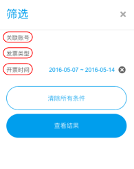

# 终端消费者

终端消费者可在 [www.efapiao.com](http://www.efapiao.com) 网站首页注册帐号，查看通过E发票平台接收的所有电子发票，并进行帐号绑定等。

## 默认页面

终端消费者使用邮箱或手机号完成注册后，登录E发票平台，平台默认显示最近一周收到的发票列表，如下图所示。

在页面上方的搜索栏内输入部分或全部发票编号，可快速搜索相关发票。

### 查看发票列表

点击我的电子发票页面右上角的**筛选**，打开筛选窗口，可查看指定的电子发票：

### 单张发票操作

点击想要查看的发票对应的**更多**下拉箭头，打开更多选项窗口：

您可以对单张发票进行如下操作：

- 点击**查看发票**，浏览器将会打开一个新窗口显示电子发票，包含发票的详细信息。

- 点击**导出版式文件**，浏览器将会自动下载电子发票到默认文件下载地址。

## 查验单张发票

点击左侧**单张发票查验**标签打开发票查验窗口，可输入发票代码、发票号码、开票日期和发票金额来查收通过E发票平台发送的电子发票版式文件。

## 绑定账号

消费者用户可设置个人资料，登录信息等。点击左侧**帐号设置**标签，打开帐号设置页面，如下图所示。

如果用户有多个邮箱或手机号码，可以通过添加关联账号来绑定多个账号，集中管理发票信息。点击页面下方的**添加关联账号**，即可添加邮箱地址或手机号码为关联账号。 

